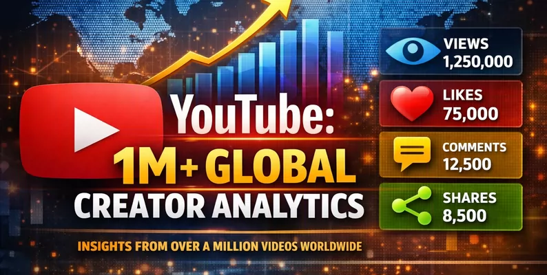
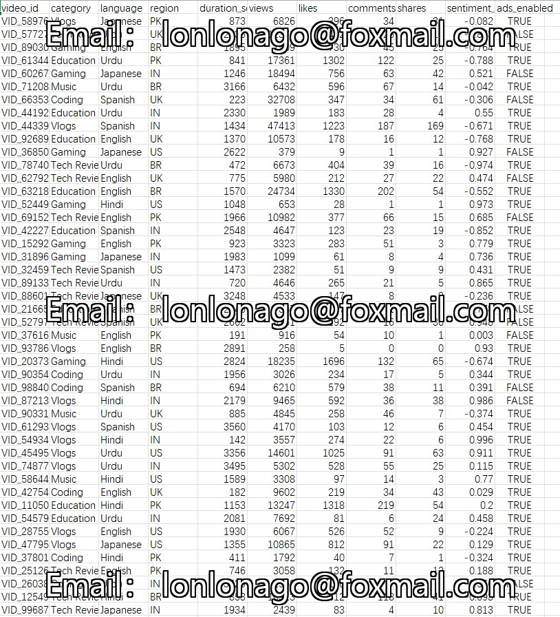

## Body

YouTube: 100,000+ Global Creator Ecosystem Analysis Data

This large-scale dataset comprehensively showcases the YouTube creator ecosystem across five global regions. It consists of 1 million records, simulating real API responses for trend analysis, engagement prediction, and sentiment research based on natural language processing.

Dataset Statistics

Timestamp - Date Time - The exact date and time when the video metric was recorded.
Video ID - String - The unique identifier for each video.
Category - Classification - The type of content (e.g., technology, education, gaming).
Language - Classification - The primary language used in the video.
Region - Classification - The geographical location where the video was published.
Duration Seconds - Integer - The total duration of the video in seconds.
View Count - Integer - The total number of views at the time of recording.
Likes - Integer - The total number of likes received.
Comments - Integer - The total number of comments made by users.
Shares - Integer - The number of shares made by the video on other platforms.
Sentiment Score - Floating - A score derived from natural language processing, ranging from -1.0 (negative) to 1.0 (positive).
Ad Enabled Status - Boolean - Indicates whether the creator has monetized their video.

## Images

item_1028535292549

Here is a pay link on Stripe ( https://buy.stripe.com/3cs8yP7sY87d0vu9AB ). Please contact me lonlonago@foxmail.com after funding $89, and I will send you a complete data files , thank you!

